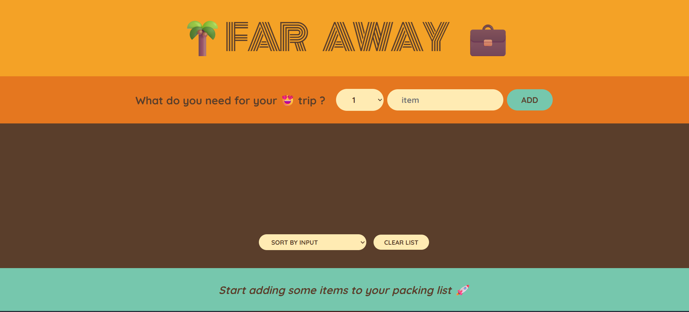
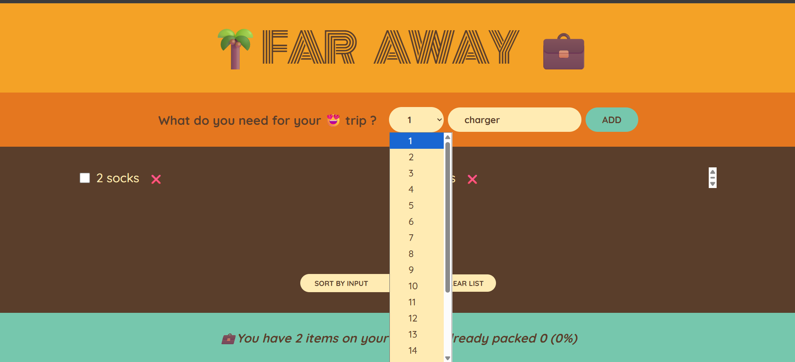
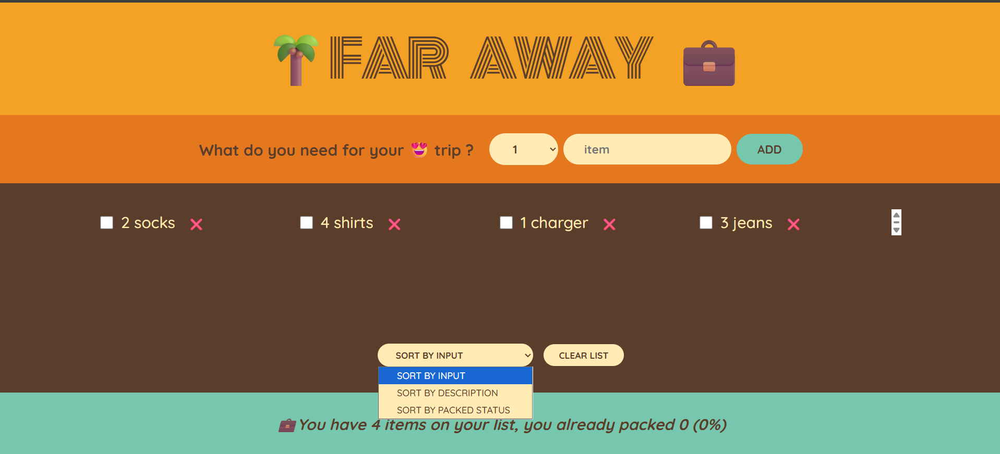
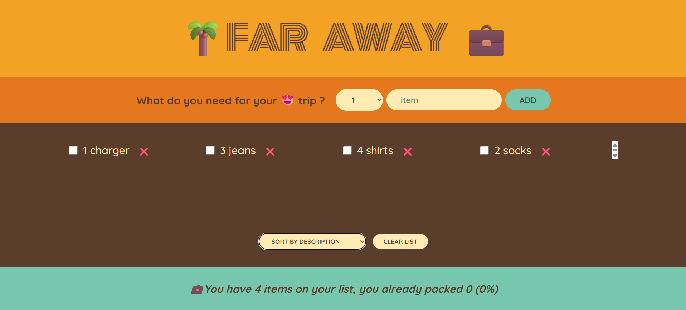
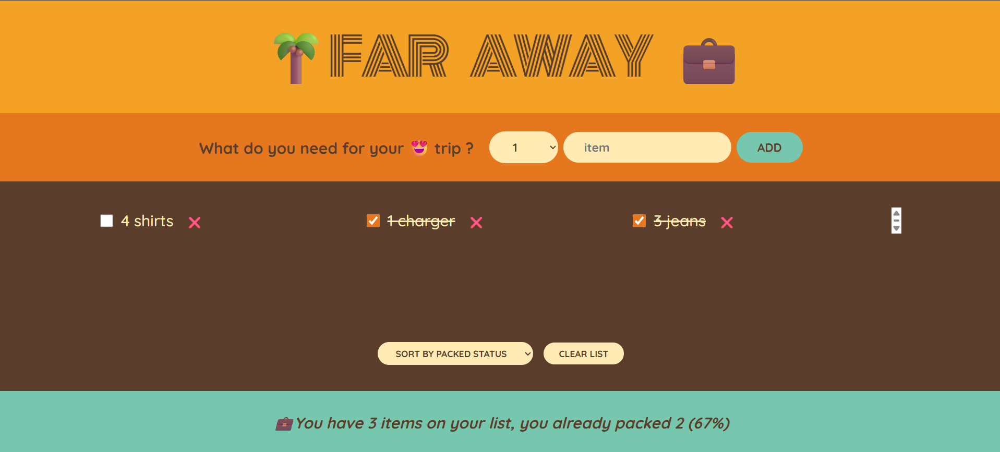
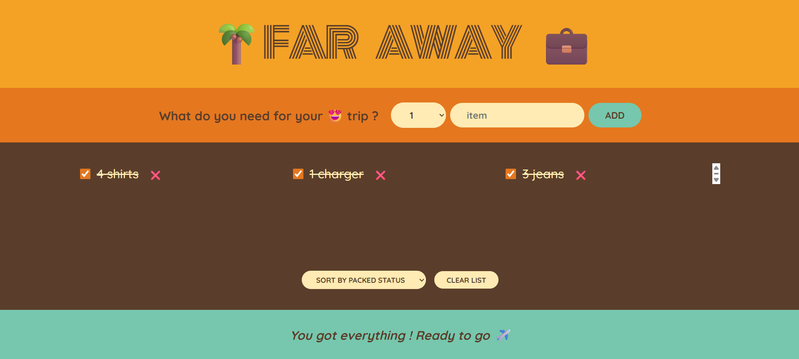
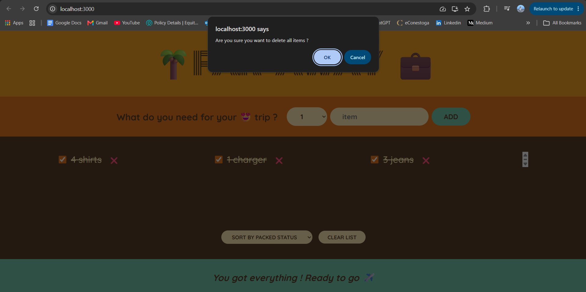

# Travel-List

A basic tracking app, enabling user to add items to the packing list, mark them as done by checkbox, delete from list and displaying in an interactive way.
While the user only controls adding and deleting items, along with marking them as packed, the app also allows the users to sort the items by description, input or packed status.
Other than this, the footer message also varies based on how much is packed in percentage, the number of items packed and the total number of items to be packed. Also, when nothing is packed or everything is packed there exist different messages as well.

## Features

- add items to packing list
- delete from list
- mark as packed
- sort by description, input and packed status
- display percentage of list packed

## Screenshots

## Tech Stack

- React
